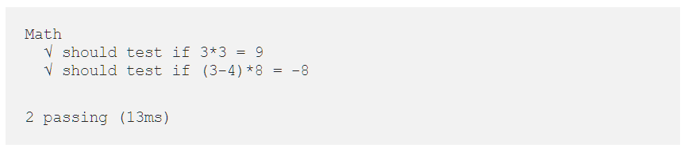

# Mocha-Testing-Tutorial
### Unit Testing in JavaScript with Mocha
Mocha is a feature-rich JavaScript test framework running on Node.js and in the browser, making asynchronous testing simple and fun.

- intall node.js  
- create a folder on your local machine
- open this folder in VS Code 
- open terminal -> npm install -g mocha
- create a project directory named test
- inside the test create a file.js file
- initialize the project -> npm init (this will create a package.json file)
- Your file structure should look like this:
  * myProjectFolder
    * node_modules
	* test
      * test.js
	  * package.json
- write a test inside your test.js
- run mocha -> npm test

#### Example
*Here is a link for this example:* https://codeburst.io/how-to-test-javascript-with-mocha-the-basics-80132324752e
1. Create a test group named Math
2. Create two tests within the group Math.
3. Test one: Should test if 3*3 = 9
4. Test two: Should test if (3–4)*8 = -8
``` JavaScript
// Require the built in 'assertion' library
var assert = require('assert');
// Create a test suite (group) called Math
describe('Math', function () {
    // Test One: A string explanation of what we're testing
    it('should equal to 9', function () {
        // Our actual test: 3*3 SHOULD EQUAL 9
        assert.equal(9, 3 * 3);
    });
    // Test Two: A string explanation of what we're testing
    it('should equal to -8', function () {
        // Our actual test: (3-4)*8 SHOULD EQUAL -8
        assert.equal(-8, (3 - 4) * 8);
    });
});
```
*Run the test => npm test*

